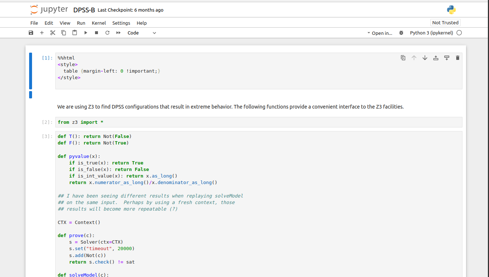

# DPSS Models

This repository contains formal models of the Distributed Perimeter
Surveillance System version B (DPSS-B) algorithm.

## Z3 Model

This model has been built and tested under Linux Mint 19.3.  To build
the docker image, type `make docker` at the shell prompt at the root
of this directory.  The only prerequisites should be `make` and
`docker` and access to the internet to download software into the
docker image.

```
$> make docker
```

To start the Jupyter server, type `./start.sh` at the shell prompt
at the root of this directory.

```
$> ./start.sh
```

To connect to the server, open a web browser and navigate to
`http://localhost:8893`.  You should see a file browser interface that
includes a listing for a `work` directory.  Double click on the `work`
directory.  You should see a file browser interface with an entry for
the file `DPSS-B.ipynb`.  Double click on the `DPSS-B.ipynb` file and
that should open the DPSS-B Jupyter notebook, as shown below.



Clicking on the `fast forward` button just under the `Settings`
heading will re-run all of the events in the notebook and re-generate
all of the notebook contents.  At this point you can interact with
the notebook and explore the impact of different changes.

When you are done exploring, you will want to stop the server.  To
stop the server, type `./stop.sh` at the shell prompt at the root of
this directory.

```
$> ./stop.sh
```

## ACL2 Models

This model has been built and tested under Linux Mint 19.3.  The ACL2
models should build on stock ACL2 version 8.5 and, hopefully, later.
The `ACL2_SYSTEM_BOOKS` environment variable should be set to point to
the directory containing the ACL2 system books.

```
$> make
```

| File         | Top | Description |
| -------------|:---:|----------------------------------------|
| worst.lisp   | * | Quadratic Worst Case bound on consensus |
| math.lisp    |   | Utility math lemmas |
| scalar.lisp  | * | Scalar Measure Impossibility Proof |
| density.lisp | * | Reasoning about Left/Right Density in ACL2 |
| phased-delay.lisp  | * | Analysis of phased delay behavior |
| left-coordinated.lisp | * | Left coordinated invariant behaviors |
| util.lisp    |   | Utility functions/lemmas |
| binder.lisp  |   | Pattern matching patch |
| dpss.lisp    |   | DPSS model data structures |
| events.lisp  |   | DPSS events |
| equiv.lisp   |   | Def/Use UAV equivalence relations |
| step.lisp    |   | Single DPSS algorithm step |
| run.lisp     |   | Arbitrary DPSS time steps |

## License

Copyright (C) 2023, Collins Aerospace, All rights reserved.  This
software may be modified and distributed under the terms of the
3-clause BSD license.  See the LICENSE file for details.

## Acknowledgments

Collins Aerospace gratefully acknowledges the support of the Air Force
Research Lab (AFRL) Aerospace Systems Technology Research and
Assessment (ASTRA) Aerospace Technologies Development and test (ATDT)
Control Automation Research (CAR) program under contract
FA8650-21-D-2602/ FPH21-SO13.  This work was performed as fundamental
research under that effort.  Any opinions, findings, conclusions, or
recommendations expressed in this material are those of the authors
and do not necessarily reflect the view of AFRL or the US government.
